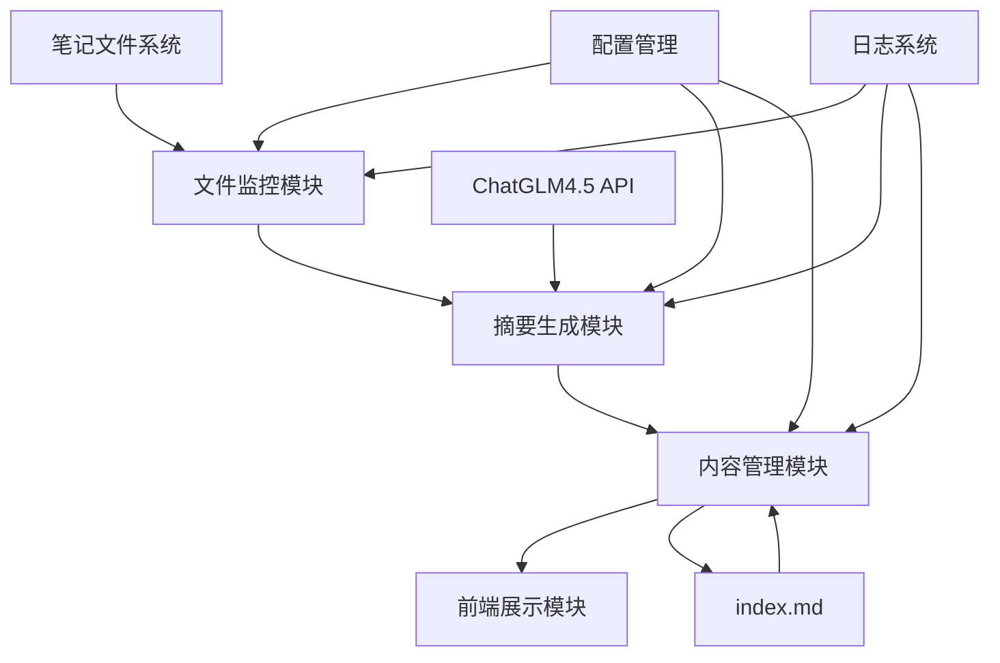

# Design Document

## Overview

自动笔记摘要系统是一个基于文件监控和AI摘要生成的自动化工具，旨在为笔记目录首页提供最新10篇笔记的智能摘要展示。系统采用模块化设计，包含文件监控、AI摘要生成、内容管理和前端展示四个核心模块。

## Architecture

### 系统架构图



### 技术栈

- **运行环境**: Node.js
- **文件监控**: chokidar
- **AI服务**: ChatGLM4.5 API
- **配置管理**: JSON配置文件
- **日志记录**: winston
- **文件处理**: fs-extra, gray-matter
- **HTTP客户端**: axios

## Components and Interfaces

### 1. 文件监控模块 (FileWatcher)

**职责**: 监控笔记目录中的文件变化，检测新增的markdown文件

**接口**:
```typescript
interface FileWatcher {
  start(): void
  stop(): void
  onFileAdded(callback: (filePath: string) => void): void
  onFileChanged(callback: (filePath: string) => void): void
}
```

**实现细节**:
- 使用chokidar监控笔记目录及其子目录
- 过滤只监控.md文件
- 忽略.obsidian等系统目录
- 实现防抖机制避免重复触发

### 2. 摘要生成模块 (SummaryGenerator)

**职责**: 调用ChatGLM4.5 API生成笔记摘要

**接口**:
```typescript
interface SummaryGenerator {
  generateSummary(content: string, title: string): Promise<NoteSummary>
  extractMetadata(filePath: string): Promise<NoteMetadata>
}

interface NoteSummary {
  title: string
  description: string
  tags: string[]
  createdAt: Date
  filePath: string
  thumbnail?: string
}
```

**实现细节**:
- 解析markdown文件的frontmatter和内容
- 构建优化的提示词模板
- 实现API调用重试机制
- 支持速率限制和错误处理

### 3. 内容管理模块 (ContentManager)

**职责**: 管理笔记摘要列表，更新index.md文件

**接口**:
```typescript
interface ContentManager {
  addSummary(summary: NoteSummary): Promise<void>
  updateIndexFile(): Promise<void>
  getSummaries(): NoteSummary[]
  maintainMaxCount(maxCount: number): void
}
```

**实现细节**:
- 维护内存中的摘要列表
- 按时间排序，保持最新10条
- 生成markdown格式的摘要卡片
- 原子性更新index.md文件

### 4. 配置管理模块 (ConfigManager)

**职责**: 管理系统配置，支持热重载

**接口**:
```typescript
interface ConfigManager {
  getConfig(): SystemConfig
  updateConfig(config: Partial<SystemConfig>): void
  onConfigChange(callback: (config: SystemConfig) => void): void
}

interface SystemConfig {
  chatglm: {
    apiKey: string
    endpoint: string
    model: string
    maxTokens: number
    temperature: number
  }
  monitoring: {
    watchPaths: string[]
    ignorePatterns: string[]
    debounceMs: number
  }
  content: {
    maxSummaries: number
    summaryLength: number
    indexFilePath: string
  }
}
```

## Data Models

### 笔记摘要数据模型

```typescript
interface NoteSummary {
  id: string                    // 唯一标识符
  title: string                 // 笔记标题
  description: string           // AI生成的摘要描述
  tags: string[]               // 标签列表
  createdAt: Date              // 创建时间
  updatedAt: Date              // 更新时间
  filePath: string             // 文件路径
  thumbnail?: string           // 缩略图路径
  category: string             // 分类（从路径推断）
  wordCount: number            // 字数统计
}
```

### 配置数据模型

```typescript
interface SystemConfig {
  chatglm: ChatGLMConfig
  monitoring: MonitoringConfig
  content: ContentConfig
  logging: LoggingConfig
}

interface ChatGLMConfig {
  apiKey: string
  endpoint: string
  model: string
  maxTokens: number
  temperature: number
  timeout: number
  retryAttempts: number
}
```

## Error Handling

### 错误分类和处理策略

1. **API调用错误**
   - 网络超时: 重试机制，最多3次
   - API限流: 指数退避重试
   - 认证失败: 记录错误，使用默认摘要

2. **文件系统错误**
   - 文件读取失败: 跳过该文件，记录警告
   - 权限不足: 记录错误，继续监控其他文件
   - 磁盘空间不足: 暂停写入操作

3. **配置错误**
   - 配置文件损坏: 使用默认配置
   - 必需参数缺失: 抛出启动错误

### 错误恢复机制

```typescript
class ErrorHandler {
  handleAPIError(error: APIError): Promise<NoteSummary> {
    if (error.isRetryable()) {
      return this.retryWithBackoff(error.operation)
    }
    return this.generateFallbackSummary(error.context)
  }
  
  handleFileSystemError(error: FSError): void {
    this.logger.warn(`File system error: ${error.message}`)
    this.metrics.incrementErrorCount('filesystem')
  }
}
```

## Testing Strategy

### 单元测试

1. **文件监控模块测试**
   - 模拟文件创建/修改事件
   - 测试过滤规则和防抖机制
   - 验证回调函数正确触发

2. **摘要生成模块测试**
   - Mock ChatGLM API响应
   - 测试不同内容类型的摘要生成
   - 验证错误处理和重试逻辑

3. **内容管理模块测试**
   - 测试摘要列表的增删改查
   - 验证index.md文件更新逻辑
   - 测试最大数量限制功能

### 集成测试

1. **端到端流程测试**
   - 创建测试笔记文件
   - 验证完整的处理流程
   - 检查最终的index.md输出

2. **API集成测试**
   - 使用真实的ChatGLM API
   - 测试不同类型的笔记内容
   - 验证摘要质量和格式

### 性能测试

1. **并发处理测试**
   - 同时创建多个笔记文件
   - 测试系统的处理能力
   - 验证资源使用情况

2. **长期运行测试**
   - 24小时连续运行测试
   - 监控内存泄漏和性能衰减
   - 验证日志轮转和清理机制

## Implementation Details

### 项目结构

```
scripts/
├── auto-summary/
│   ├── index.js              # 主入口文件
│   ├── config/
│   │   ├── default.json      # 默认配置
│   │   └── production.json   # 生产环境配置
│   ├── modules/
│   │   ├── fileWatcher.js    # 文件监控模块
│   │   ├── summaryGenerator.js # 摘要生成模块
│   │   ├── contentManager.js # 内容管理模块
│   │   └── configManager.js  # 配置管理模块
│   ├── utils/
│   │   ├── logger.js         # 日志工具
│   │   ├── apiClient.js      # API客户端
│   │   └── fileUtils.js      # 文件工具
│   └── templates/
│       ├── summary-card.md   # 摘要卡片模板
│       └── prompt.txt        # AI提示词模板
```

### 启动流程

1. 加载配置文件
2. 初始化日志系统
3. 启动文件监控
4. 扫描现有笔记文件
5. 生成初始摘要列表
6. 更新index.md文件
7. 开始监控新文件

### 摘要卡片模板

```markdown
## 📝 [{{title}}]({{filePath}})

**分类**: {{category}} | **创建时间**: {{createdAt}} | **字数**: {{wordCount}}

{{description}}

**标签**: {{#each tags}}#{{this}} {{/each}}

---
```

### ChatGLM提示词模板

```
请为以下笔记内容生成一个简洁的摘要：

标题：{{title}}
内容：{{content}}

要求：
1. 摘要长度控制在50-100字
2. 突出核心观点和关键信息
3. 如果包含技术内容，请说明应用场景
4. 提取3-5个相关标签
5. 使用简洁明了的语言

请以JSON格式返回：
{
  "description": "摘要内容",
  "tags": ["标签1", "标签2", "标签3"]
}
```